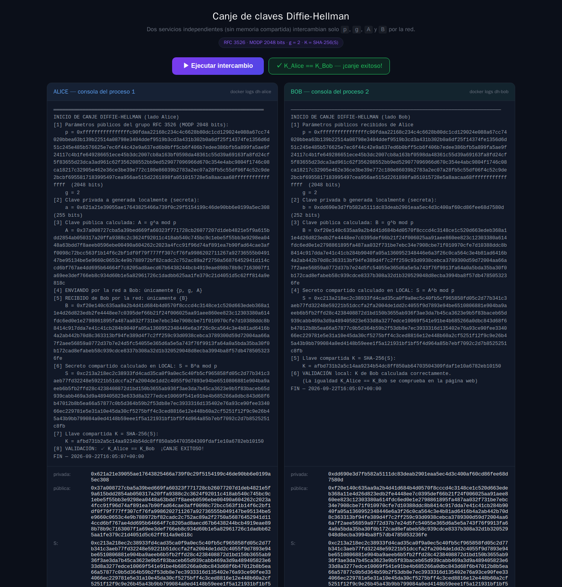

# demo-crypt

Implementación didáctica del protocolo de intercambio de claves
**Diffie-Hellman** con **dos aplicaciones independientes** (sin memoria
compartida) que se comunican **solo por HTTP** a través de la red.

**Demo en vivo:** [https://dh.maxthecoder.online](https://dh.maxthecoder.online)



## Qué hace

```
Navegador ──HTTPS──► Cloudflare ──túnel──► dh-alice:5000  (Alice + UI)
                                               │
                                               │  HTTP interno
                                               │  solo {p, g, A}  →  {B}
                                               ▼
                                            dh-bob:5000           (Bob, interno)
```

| Contenedor | Rol | Alcanzable desde |
|---|---|---|
| `dh-alice` | Genera `a`, `A`; envía `{p, g, A}`; recibe `{B}`; calcula `S`, `K`; sirve la web | Túnel público |
| `dh-bob` | Recibe `{p, g, A}`; genera `b`, `B`; calcula `S`, `K`; devuelve **solo `{B}`** | Solo red Docker `services` |

Ambos corren en la red externa `services` (la misma que `cloudflare-tunnel`);
**ningún puerto se publica en el host**: todo el tráfico entra por el túnel.

## Requisitos cubiertos

- [x] Dos aplicaciones distintas (Alice y Bob) en paralelo, sin memoria compartida
- [x] Por la red viajan **únicamente** `p`, `g`, `A` y `B` (parámetros públicos y claves públicas)
- [x] Cada instancia genera su clave privada y calcula el secreto `S` de forma autónoma
- [x] A `S` se le aplica SHA-256 en ambas instancias para obtener la llave compartida `K`
- [x] Cada consola imprime claves públicas, privadas y `K` para comprobar `K_Alice == K_Bob`
- [x] Código comentado y documentado, con validaciones `try`/`except`
- [x] Capturas de pantalla en [`evidencias/`](evidencias/)

## Parámetros del grupo

| Parámetro | Valor |
|---|---|
| Grupo | **RFC 3526 — MODP 2048 bits** (grupo 14) |
| Generador | `g = 2` |
| Exponentes privados | 256 bits (`secrets.randbits`) |
| Llave compartida | `K = SHA-256(S)` en hexadecimal |

## Mensajes del protocolo

Lo **único** que cruza la red entre Alice y Bob:

1. Alice → Bob: `{ p, g, A }`
2. Bob → Alice: `{ B }`

Cada quien calcula **localmente**:

```
Alice:  S = B^a mod p     K = SHA-256(S)
Bob:    S = A^b mod p     K = SHA-256(S)
```

Los valores privados (`a`, `b`) y el secreto `S` **jamás** se transmiten.

> **Nota:** `GET /estado` de Bob es introspección de demo (no del
> protocolo): solo existe para que la página pinte la consola de Bob y
> muestre el check `K_Alice == K_Bob` en la misma pantalla. En un sistema
> real este endpoint no existiría.

## Quickstart

```sh
git clone git@github.com:CantDecodeMe/demo-crypt.git
cd demo-crypt
docker compose up -d --build
```

Abrir [https://dh.maxthecoder.online](https://dh.maxthecoder.online) y pulsar
**▶ Ejecutar intercambio**.

### Validar en consola

```sh
docker logs dh-alice
docker logs dh-bob
```

Ambas muestran `p`, `g`, clave privada, clave pública, `S`, `K` y la línea
de validación:

```
[8] VALIDACIÓN: ✓ K_Alice == K_Bob  ¡CANJE EXITOSO!
```

### Detener

```sh
docker compose down
```

## Estructura

```
demo-crypt/
├── docker-compose.yml        # 2 servicios en red externa "services"
├── setup_cloudflare.sh       # ingress + CNAME dh.maxthecoder.online
├── alice/
│   ├── Dockerfile
│   ├── requirements.txt
│   ├── app.py                # Flask + lógica DH de Alice + UI
│   └── templates/index.html  # página con las dos consolas
├── bob/
│   ├── Dockerfile
│   ├── requirements.txt
│   └── app.py                # Flask + lógica DH de Bob
├── evidencias/               # capturas y logs de validación
├── AGENTS.md
└── README.md
```

## Cloudflare Tunnel

`setup_cloudflare.sh` agrega la Public Hostname
`dh.maxthecoder.online → http://dh-alice:5000` al túnel existente de la Pi
(por API, sin tocar las reglas de los demás servicios) y crea el CNAME
proxied:

```sh
bash setup_cloudflare.sh
```

Requiere `CLOUDFLARE_API_TOKEN` en `~/.config/cloudflared/api.env`.

## Evidencias

Capturas y logs en [`evidencias/`](evidencias/):

| Archivo | Qué muestra |
|---|---|
| `captura_ui_02_intercambio_exitoso.png` | UI tras el canje con el check verde |
| `captura_validacion_ambas_consolas.png` | Consolas de Alice y Bob lado a lado |
| `captura_consola_alice.png` / `captura_consola_bob.png` | Cada consola por separado |
| `docker_logs_*.txt` | Logs completos de ambos contenedores |
| `intercambio.json` | Respuesta JSON del canje (`match: true`) |

## Licencia

Proyecto educativo. Úsalo y modifícalo libremente.
